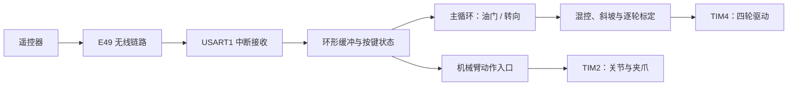

# 基于 STM32 的足球对抗机器人

> 围绕无线遥控、四轮底盘和机械臂建立完整控制链路；除主控固件外，还完成了 E49 无线模块上位机、测试架和记录设计推导的技术笔记。

项目以 STM32F103VET6 控制板和四轮底盘为基础，目标是通过遥控完成足球争抢、带球与射门。个人工作覆盖控制板信号排查、无线调试工具、遥控协议解析、四轮驱动和机械臂接口。当前固件已将 E49 串口键码解析、油门与转向混控、逐轮电机标定、运动斜坡和机械臂姿态接口接入主流程。

这里的成果不止于一份能下载的程序：无线模块有独立的参数配置与透传工具，遥控协议有抓包依据，底盘参数有实车标定，板级问题和方案取舍也保留了原始笔记。它们共同构成了从定位问题到再次验证的工程闭环。

## 已完成的工程成果

| 成果 | 解决的问题 | 当前依据 |
| --- | --- | --- |
| E49 参数与透传上位机 | 配置、回读和观察无线链路不再依赖手工输入命令 | [Python 源码](433模块资料/433模块自研上位机软件/E49_400T20S_上位机.py)、[Windows 程序](433模块资料/433模块自研上位机软件/E49_400T20S_上位机.exe)、[操作说明](433模块资料/433模块自研上位机软件/关于操作.txt) |
| 遥控输入与底盘控制固件 | 交错到达的按键可以组合为前进、后退和转向指令 | [BSP_433.c](New_zuqiu_PK/New_zuqiu_PK/User_BSP/BSP_433.c)、[BSP_Motor.c](New_zuqiu_PK/New_zuqiu_PK/User_BSP/BSP_Motor.c)、[main.c](New_zuqiu_PK/New_zuqiu_PK/Core/Src/main.c) |
| 板级与协议技术笔记 | 保留信号追踪、抓包、参数选择和方案推导过程 | [个人笔记整理](个人笔记整理/)、[E49 工程参考](<433模块资料/E49-400T20S_实用参考与报文解析(个人整理,仅供参考).md>) |
| 机械臂角度接口 | 将动作描述从舵机 CCR 转换为连杆姿态 | [BSP_servo.c](New_zuqiu_PK/New_zuqiu_PK/User_BSP/BSP_servo.c)、[BSP_servo.h](New_zuqiu_PK/New_zuqiu_PK/User_BSP/BSP_servo.h) |

## 核心亮点

### 1. 从控制板信号路径入手排查硬件问题

控制板上的 PA9/PA10 与 CH340、外设接口之间经过 `74LVC4245APW` 电平转换。只看 MCU 引脚定义，无法解释为什么同一个串口在不同跳线状态下表现不同。[控制板分析笔记](个人笔记整理/关于控制板的理解.docx)追踪了 `R43`、`IO_DIR2` 与转换方向的关系，明确了串口烧录和外设通信各自依赖的板级条件。这让后续遇到通信异常时，可以先检查实际信号路径，再检查软件协议。

遥控器侧也保留了接口照片与烧录入口研究，见[遥控器研究笔记](个人笔记整理/关于遥控器的研究.docx)。现有改装集中在无线部分，包括信号增强和模块飞线连接；遥控器发送逻辑的重构是下一阶段工作。

### 2. 把 E49 调试做成可独立使用的桌面工具

E49 的 M0/M1 模式切换、串口参数和 `C0`/`C2` 配置帧使通用串口助手的手工操作难以复现。项目先制作了跳线切换模式的测试架，记录接线、命令与模块回包，再用 Python、Tkinter 和 pyserial 实现专用上位机。

上位机支持读取参数与版本、永久或临时写入、透明传输、HEX/文本发送和带时间戳的收发日志。读取结果与待写入参数分区显示，写入后可重新回读核对；接收解析处理串口拆包、前导噪声、无效候选帧和超时。源码提供 `--self-test` 离线协议自测，当前版本为 `2.1.0`。测试架与软件界面的实测记录见[模块测试笔记](个人笔记整理/433模块串口发送.docx)，完整接线和报文解释见[E49 工程参考](<433模块资料/E49-400T20S_实用参考与报文解析(个人整理,仅供参考).md>)。

这套工具把无线模块从整车中单独拿出来配置和验证：参数、串口字节和回包都可观察，排查链路问题时不必先改主控代码。

### 3. 从真实抓包设计遥控输入，而不是只记住最后一个键

[串口接收思路笔记](个人笔记整理/关于串口接收模块思路.docx)记录了两字节按键码的原始数据。长按时键码重复发送，同时按“前进 + 左转”时两组键码交错出现。若只保存最近收到的键码，一个动作就会覆盖另一个动作。

[`BSP_433.c`](New_zuqiu_PK/New_zuqiu_PK/User_BSP/BSP_433.c)采用“中断收字节、主循环解析”的结构：UART 回调写入带接收时间的环形缓冲区；解析器按两字节组帧，对无效数据滑动重同步；每个按键分别保存状态和最后接收时间，用超时表达松键。一次性按键另设重复触发间隔，串口错误或缓冲区溢出时清除按键状态。主循环再将前后与左右映射为独立的油门和转向轴，因此能够组合出弧线转弯，单独转向则可原地旋转。

长按曾出现间歇停顿，原因链路集中在发送间隔与接收端状态保持时间的配合；目前经过临时调整可以使用，后续将从遥控器发送代码继续重构。

### 4. 用实车标定参数隔离四轮驱动差异

原有驱动板使用约 20 ms 周期、低电平有效的脉宽控制。旧硬件的停车中位、启动死区和轮间速度差，无法用一组统一 PWM 数值解决。[电机驱动思路笔记](个人笔记整理/关于电机驱动的思路.docx)先把物理脉宽、逻辑速度和车体运动分开，再确定驱动接口。

[`BSP_Motor.h`](New_zuqiu_PK/New_zuqiu_PK/User_BSP/BSP_Motor.h)集中配置四轮中位、前进极性、输出幅度、死区和左右平衡；[`BSP_Motor.c`](New_zuqiu_PK/New_zuqiu_PK/User_BSP/BSP_Motor.c)将 `[-10000, 10000]` 的逻辑指令映射到各轮 CCR。零指令直接回到各自中位，非零指令补偿启动死区。底盘采用 `左侧 = 油门 + 转向`、`右侧 = 油门 - 转向` 混控，并结合车体尺寸处理内侧轮速度、做等比例限幅，避免单侧先饱和改变转向比例。

油门与转向分别进行斜坡控制；转向还设最小有效值、点按起步、长按加速和反向过零处理。当前四轮中位 `1440`、左右平衡系数 `0.945` 等值均已在实车标定。上层只需给出运动意图，驱动层负责各轮的方向、停车偏移和起步特性。

### 5. 用连杆姿态表达机械臂动作

三段机械臂如果直接以舵机 CCR 编写动作，关节安装方向和连杆姿态会混在一起。[`BSP_servo.c`](New_zuqiu_PK/New_zuqiu_PK/User_BSP/BSP_servo.c)接收各段连杆相对地面的绝对角，再换算为关节局部角，结合逐关节水平零点与方向参数输出 TIM2 PWM；原始 CCR 接口仍用于标定和夹爪控制。三个关节的水平位 `1500` 和方向参数已完成实机标定。

当前主程序上电设置三段水平姿态，并通过一次性按键切换夹爪。绝对角接口为后续抓球、带球动作提供了动作层入口；相关动作序列尚未接入主流程。

## 控制链路与工程组织

固件采用 STM32 HAL/CubeMX 与 Keil MDK 工程。`Core/` 负责外设初始化和主循环，`User_BSP/` 负责无线输入、底盘和机械臂接口。配置项集中在各驱动头文件，便于移植时从硬件参数入手；`个人笔记整理/` 则记录这些参数和接口为什么这样设计。

## 验证状态与资料入口

- **实物标定**：四轮停车中位、左右平衡和机械臂水平位/方向已经在实车确认；无线模块测试架留有回包与上位机界面记录。
- **软件自测**：E49 上位机可运行 `python E49_400T20S_上位机.py --self-test`，覆盖协议编解码与接收重新同步；本次文档整理已运行通过。
- **固件构建**：既有 Keil 构建记录为 0 error、0 warning；整车场地性能尚无统一测试数据。
- **工程入口**：[Keil 工程](New_zuqiu_PK/New_zuqiu_PK/MDK-ARM/New_zuqiu_PK.uvprojx)、[CubeMX 配置](New_zuqiu_PK/New_zuqiu_PK/New_zuqiu_PK.ioc)、[技术笔记](个人笔记整理/)、[E49 上位机](433模块资料/433模块自研上位机软件/)。

目前展示的是已经接入固件的遥控行驶与夹爪控制链路，以及支撑这条链路的调试工具和设计资料；完整的抢球动作、比赛场景效果仍需后续实测与迭代。
